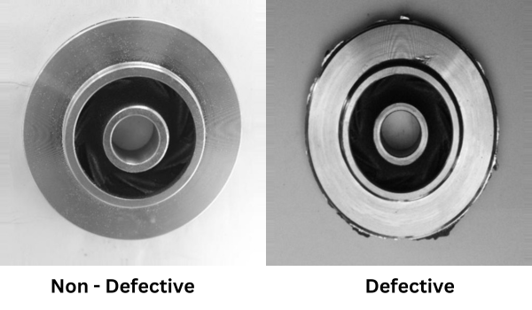
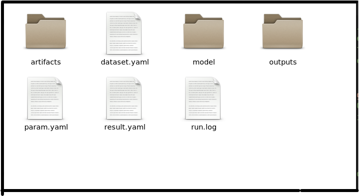
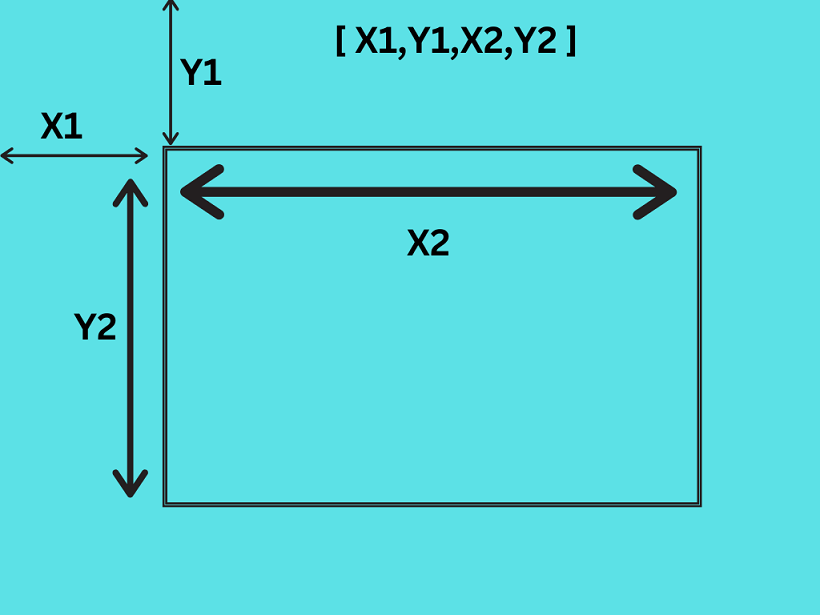
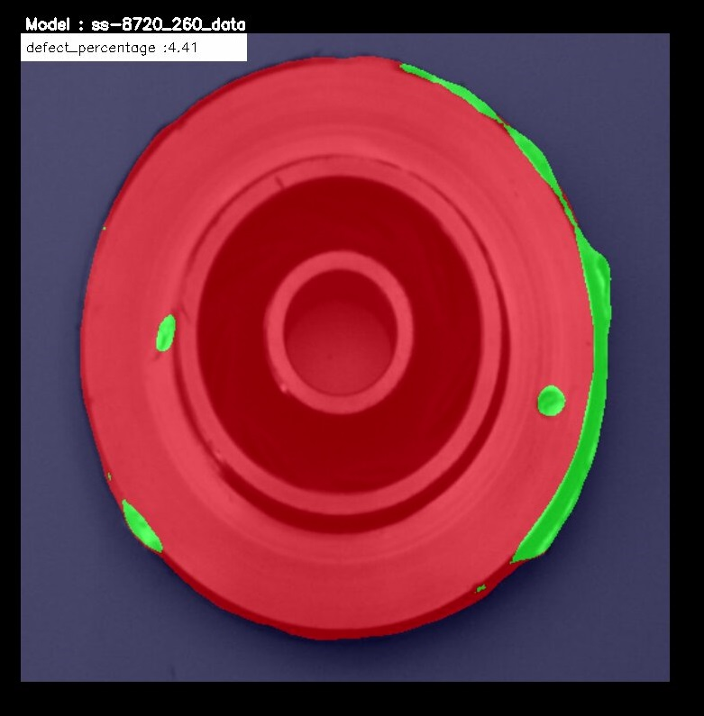
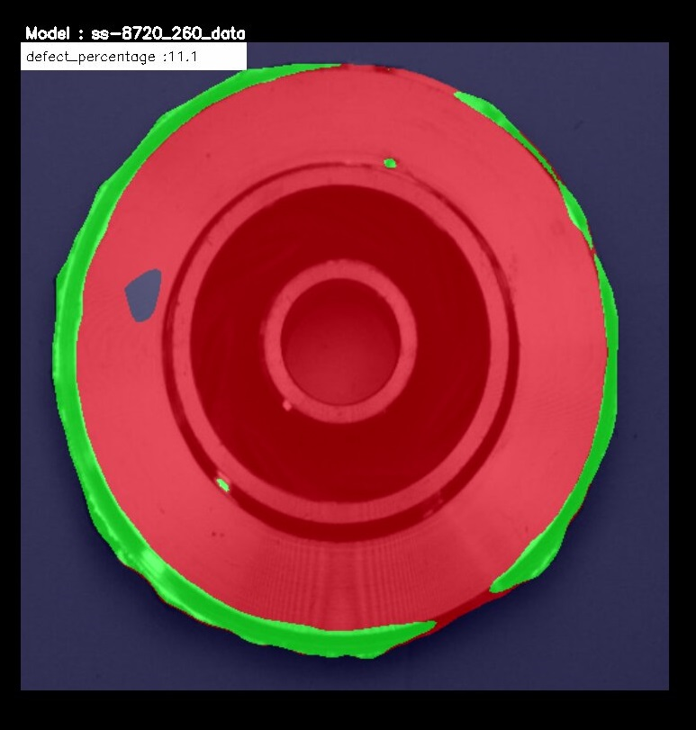

# defect-detection-using-semantic-segmentation

This Github Repository adds support for **Defect Detection** Using [EDGE-AI-Model-Maker](https://github.com/TexasInstruments/edgeai-modelmaker) tool for TI Embedded Processor.

## 1. Defect Detection in Casting Product Image Data
Dataset is of casting manufacturing product. These are top view of submersible pump impeller.\
Casting is a manufacturing process in which a liquid material is usually poured into a mould, which contains a hollow cavity of the desired shape, and then allowed to solidify.\
The Dataset is taken from the **Kaggle**. [link to dataset](https://www.kaggle.com/datasets/ravirajsinh45/real-life-industrial-dataset-of-casting-product)

This project Uses **Semantic segmentation** for detecting the defect.\
The pixel corresponding to Defective area will be colored. 




## 2. Setting Up Model Maker

The [edgeai-modelmaker](https://github.com/TexasInstruments/edgeai-modelmaker) is an end-to-end model development tool that contains dataset handling, model training and compilation.\
**This is a commandline tool and requires a Linux PC.**\
Go to [this repository](https://github.com/TexasInstruments/edgeai-modelmaker) to know the Edgeai-modelmaker in detail and install it on Linux PC.

:o: Note: 
1. I tried to run the model in the Virtual Box, it didn't worked for me. This needs a CUDA enabled Linux PC to run.
2. I installed the model from the github and tried to run to run but it didn't worked for me. So i installed it from TI's BigBucket Page. [edgeai-model-maker Bitbucket](https://bitbucket.itg.ti.com/projects/EDGEAI-ALGO/repos/edgeai-modelmaker/browse). If you see the `setup_all.sh` file you will get to know that another 4 repository are cloned to run the model-maker.  
a. edgeai-torchvision\
b. edgeai-edgeai-mmdetection\
c. edgeai-benchmark\
d. edgeai-model_zoo

3. I used some specific branch of all 4 repository above because some branches was not working for me. The repo and their branches which i cloned are listed below. Just change these branches in `setup_all.sh` script.\
a. edgeai-torchvision -> `2023/badri-segmentation` \
b. edgeai-edgeai-mmdetection -> `master`\
c. edgeai-benchmark -> `badri-segmentation`\
d. edgeai-model_zoo ->  `master`

:o: Note : You can clone only one branch for faster installation.

Follow each instructions in the Model-Maker Github Page to set up the Model Maker.

## 3. Annotating Data
The annotation file must be in **COCO JSON** format.

**If you are using Label Studio take note of following:**  

- For Semantic Segmentation we can export data in COCO-JSON format only if we use polygon tool to annotate data.  
- :o: Note: We can't export data in COCO JSON format if we use brush tool for semantic segmentation annotation in Label Studio. 

**How to use label studio**

- Make an account in label-studio by signing up.
- Create a new project in Label Studio and give it a name in the "Project Name" tab.
- In the Data Import tab upload your images. (You can upload multiple times if your images are located in various folders in the source location).
- Go to Setting at top right.
- In the tab named "Labelling Setup ->" click on "Browse Template". choose "Semantic Segmentation with Mask" .
- Remove the existing "Choices" and add your Label Choices (Object Types) that you would like to annotate. Clip on Save.
- Now the "project page" is shown with list of images and their previews.
- Now click on an image listed to go to the "Labelling" page.
- Do not forget to click "Submit" before moving on to the next image. The annotations done for an image is saved only when "Submit" is clicked.
- After annotating the required images, go back to the "project page", by clicking ont he project name displayed on top. From this page we can export the annotation.
- Export the annotation in COCO-JSON. 

### 3.a Semantic segmentation Dataset Format
- The annotated json file and images must be under a suitable folder with the dataset name.
- Under the folder with dataset name, the following folders must exist:
1. there must be an "images" folder containing the images
2. there must be an annotations folder containing the annotation json file with the name given below.

```
edgeai-modelmaker/data/downloads/datasets/dataset_name
                             |
                             |--images
                             |     |-- the image files should be here
                             |
                             |--annotations
                                   |--instances.json
```

Once data have been annotated , exported in COCO-JSON format , and been placed the data in above format, its time to start the training and compilation of the model.

## 4. Training and Compilation

Make sure you have activated the python virtual environment. By typing  `pyenv activate py36` .\
\
**Setting up configuration file.**
- Go the `edgeai-modelmaker/config_segmentation.yaml` to set up the configuration file.
- In yaml file under `common` change the `target_device` name according to your device.
- Under `dataset` change the `annotation_perfix` with the name of annotation file in `edgeai-modelmaker/data/downloads/datasets/dataset_name/annotations`. For example if the name of your annotation file is "abcd.json". Then update `annotation_prefix:'abcd'`
- `dataset_name` : You can give any name of your choice.
- `input_data_path: ` Here give path to the dataset. `./data/downloads/datasets/dataset_name`

- Under `training` tune the parameters.
- `num_gpu` is the number's of GPU you will be using for the training.

- Then finally under `compilation` tune parameter according to your need. You can add `calibration_frames` and `calibration_frames` also.
```
compilation:
    # enable/disable compilation
    enable: True #False
    tensor_bits: 8 #16 #32
    calibration_frames: 10
    calibration_iterations: 10
```

After Setting up the configuration file go to `edgeai-modelmaker` directory in terminal and enter the following command and hit Enter.
```
./run_modelmaker.sh <target_device> config_segmentation.yaml
```

The training and compilation will take a good amount of time.

The Compiled model will be saved to `edgeai-modelmaker/data/projects/dataset_name`

## 5. Deployment on the Board
Once The compilation is completed we can deploy the compiled model on the board.

We have to copy `edgeai-modelmaker/data/projects/dataset_name/run/20230605-174227/fpn_aspp_regnetx800mf_edgeailite/compilation/TDA4VM/work/ss-8720` this folder to the board.
The content of this file is shown in below picture.



### 5.a Connecting Board to PC using UART
1. Install the [MobaXterm](https://mobaxterm.mobatek.net/download.html) to the PC to remotely connect to the Board.
2. Once installed connect the board to the PC through the UART cable. 
3. Open MobaXterm and Click on session.
4. Click on the Serial and select a Port from the drop down.
5. Baud rate should be configured to **115200** bps in serial port communication program. 

:o: Note: If using a Windows computer, the user may need to install additional drivers for ports to show up. (https://www.silabs.com/developers/usb-to-uart-bridge-vcp-drivers).\
Click on the link. Go to Downloads. Download and install ***CP210x Windows Drivers with Serial Enumerator***.

6. Once the port are visible, Connect to all the ports and Reboot the board. 
7. The boot log will be visible in one of the ports. Other ports may be closed.
8. In login prompt : type `root` as user.
9. Your current directory in terminal will be like: `/opt/edgeai-gst-apps`

### 5.b Connecting remotely using SSH
 You can also access the device with the IP address that is shown on the display. With the IP address one can ssh directly to the board.\
 In MObaXterm:
 1. Click session
 2. Click SSH
 3. Enter the IP displayed at board
 4. Hit enter
 5. In the login prompt:  type `root` as user.
 
One Can also use **VS code** to remotely login using SSH.

After login when You go to the `/opt` the directory structure will be like this:


`/opt/edgeai-gst-apps`  Contains the apps to run the model.\
`/opt/model_zoo` contains all the model. The downloaded model from the EDGE AI STUDIO will be saved here.\
`/opt/edgeai-test-data` contains the input data ( image , videos to run the model ).


### 5.c Copying Downloaded model to the board

We can use `scp` Command to copy the model from our PC to the board.
1. Open your terminal
2. Go to the directory where Model is saved.
3. Type the following command:

```
scp -r model_folder_name root@ip_address_of_board:/opt/model_zoo
```
Note: ip_address_of_board will be shown on the monitor when you will start the board after connecting to all peripheral.


## 6. Testing on the board

### 6.a Importing data on the board for testing
Before Importing Images to the board, Rename the images file sequentially.
```0000.png , 0001.png ,0002.png ......... 000n.png```
It will help in slide showing images on the screen.

To copy the data to the board `scp` command can be used again.
1. Go to the folder where image folder is located.
2. Type the below command.
`scp -r image_folder_name root@ip_address_of_device:/opt/edgeai-test-data`
3. Hit enter
4. All the images files will be copied to `opt/edgeai-test-data/image_folder_name`


### 6.b Making Configuration file
Next task is to make Configuration file for the project. 
The config folder is located at `opt/edgeai-gst-apps/configs`
(You can make a copy of the existing `.yaml` file and edit it or else you can write a new `.yaml` file.)

**Component of config file**

```
title: "Defect Detection Using Semantic Segmentation"
log_level: 2
inputs:
    input0:
        source: /dev/video2
        format: jpeg
        width: 1280
        height: 720
        framerate: 30
    input1:
        source: /opt/edgeai-test-data/videos/video_0000_h264.h264
        format: h264
        width: 1280
        height: 720
        framerate: 30
        loop: True
    input2:
        source: /opt/edgeai-test-data/Mask_dataset/%04d.png
        width: 1280
        height: 720
        index: 0
        framerate: 1
        loop: True
models:
    model0:
        model_path: /opt/model_zoo/20230530-081846_yolox_s_lite_onnxrt_TDA4VM
        alpha: 0.4
    model1:
        model_path: /opt/model_zoo/ss-8720
        alpha: 0.4
    model2:
        model_path: /opt/model_zoo/ONR-SS-8610-deeplabv3lite-mobv2-ade20k32-512x512
        alpha: 0.4
outputs:
    output0:
        sink: kmssink
        width: 1920
        height: 1080
        overlay-performance: True
    output1:
        sink: /opt/edgeai-test-data/output/output_video.mkv
        width: 1920
        height: 1080
    output2:
        sink: /opt/edgeai-test-data/output/output_image_%04d.jpg
        width: 1920
        height: 1080

flows:
    flow0: [input2,model0,output0,[320,180,1280,720]]
```

1. inputs :  
This include all the input sources.\
We can have multiple input : input 0,input 1 ....... input n.\
             `source: /dev/video2` is for the camera connected to te board.\
             `source: /opt/edgeai-test-data/videos/video_0000_h264.h264` is for the video dataset saved at the given location.\
             `source: /opt/edgeai-test-data/Casting_defect_dataset/%04d.png` is for the images at the`/opt/edgeai-test-data/Casting_defect_dataset` . Note that the images will go one by one for input as slide show.

2. models :   
Like inputs we can have different model. Path of the model in model_zoo needs to be specified here.

3. outputs:  
In this section, output path is specified.\
`kmssink` correspond to the Monitor connected to the board.\
We can also save the results as video or images files by specifying their path.

4. flows :  
In flow we specify the combination of input source ,model name and outputs destination.  
For example:  
`flow0: [input2,model0,output0,[320,180,1280,720]]`  
This means use input 2, model 0, and output 0 to run.    
[320,180,1280,720]  
In this the first number and second number is for X and Y coordinate respectively from where we want to display the result on the monitor.  
The Third number shows the length of result to be shown along X axis .  
The Fourth number shows the length of result to be shown along Y axis .  
. 

. 
:o: Note that we can write many flows using different combination of input , model and output. And we can see multiple output on the monitor.


## 7. Running the Model on the Board
Once You have done below three things:
1. Copied model to the board
2. Copied dataset to the Board
3. Added Config file

The Model is ready to run.
We can run the model using python-apps or CPP apps.
To run the Model with python apps:
1. Go to `/opt/edgeai-gst-apps/apps_python`
2. Type `./app_edgeai.py ../configs/config_file_name.yaml` in Terminal and hit Enter.


## 8. Post Processing of defect detection

Now I will do post processing of the result to get some more meaningful results. In this Post processing I will calculate the percentage defect in the the "submersible pump impeller".\
Percentage defect = [defective area / ( defective area + non defective area )] * 100

So for this count the pixel of defective area and non defective area.

Post processing in python is located at: `opt/edgeai-gst-apps/apps_python/post_process.py`

```
class PostProcessSegmentation(PostProcess):
    def __call__(self, img, results):
        """
        Post process function for segmentation
        Args:
            img: Input frame
            results: output of inference
        """
        img = self.blend_segmentation_mask(img, results[0])

        return img

    def blend_segmentation_mask(self, frame, results):
        """
        Process the result of the semantic segmentation model and return
        an image color blended with the mask representing different color
        for each class
        Args:
            frame (numpy array): Input image in BGR format which should be blended
            results (numpy array): Results of the model run
        """

        mask = np.squeeze(results)
        
        if len(mask.shape) > 2:
            mask = mask[0]

        if self.debug:
            self.debug_str += str(mask.flatten()) + "\n"
            self.debug.log(self.debug_str)
            self.debug_str = ""

        # Resize the mask to the original image for blending
        org_image_rgb = frame
        org_width = frame.shape[1]
        org_height = frame.shape[0]
        
        # 1 in mask corresponds to defective pixel
        # 0 in mask corresponds to Non defective pixel ( PUMP )
        # 2 in mask corresponds to background 
        num_defect=np.count_nonzero(mask == 1)
        num_pump=np.count_nonzero(mask==0)
        num_background=np.count_nonzero(mask==2)

        defect_percentage=round(((num_defect*100)/(num_defect+num_pump)),2)
        
        mask_image_rgb = self.gen_segment_mask(mask)
        
        mask_image_rgb = cv2.resize(
            mask_image_rgb, (org_width, org_height), interpolation=cv2.INTER_LINEAR
        )

        
        blend_image = cv2.addWeighted(
            mask_image_rgb, 1 - self.model.alpha, org_image_rgb, self.model.alpha, 0
        )
        

        cv2.rectangle(
            blend_image,
            (0, 0),
            (250, 30),
            (255,255,255),
            -1,
        )

        # for putting the Defective Percentage Text On the Result
        cv2.putText(
            blend_image,
            "defect_percentage :"+str(defect_percentage),
            (5, 20),
            cv2.FONT_HERSHEY_SIMPLEX,
            0.5,
            (0, 0, 0),1,
        )
        
        return blend_image

    def gen_segment_mask(self, inp):
        """
        Generate the segmentation mask from the result of semantic segmentation
        model. Creates an RGB image with different colors for each class.
        Args:
            inp (numpy array): Result of the model run
        """
        
        #r_map = (inp * 10).astype(np.uint8)
        #g_map = (inp * 20).astype(np.uint8)
        #b_map = (inp * 30).astype(np.uint8)

        r_map=np.copy(inp)
        r_map[r_map==0]=255
        
        g_map=np.copy(inp)
        g_map[g_map==1]=255
        
        b_map=np.copy(inp)
        b_map[b_map==2]=255
        
        return cv2.merge((r_map, g_map, b_map))
```

- Number of defective and non defective pixel in mask can be counted by `np.count_nonzero`.

- CV2.rectangle and CV2.putTest function can be used to put text on the image.

- The color of the segmentation can be changed in `gen_segment_mask` function. The pixel corresponding to defect and pump and background can be changed to some other value to change the color of the mask.

- After generating the segmentation mask it is blended with the real image.


## 9. Result





